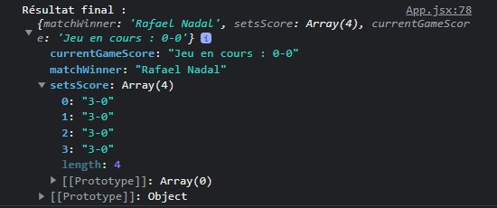

# Test 2

Lancez l'application depuis votre terminal : 
- npm i
- npm run dev

⚠️ ATTENTION : pensez à bien lancer le back-end avant d'utiliser l'application. Sinon, vous ne pourrez pas obtenir le résultat.

## Résultat et démarche

L'application fonctionne côté front. J'arrive bien à générer une liste de 150 points, distribués en fonction du niveau de chaque joueur.

Une fois les points attribués, on peut "Obtenir le score final".

En ce qui concerne cette étape, je n'ai pas réussi à obtenir le résultat escompté, c'est-à-dire le détail de chaque set et le résultat au 150è point.

Toutefois, j'arrive bien à retourner :
- un gagnant : qui fonctionne puisqu'il correspond au joueur qui a gagné le plus de points (mais pas de sets malheureusement)
- des sets (dont la valeur est toujours de 3-0 peu importe les points attribués)

Vous pouvez observer le résultat depuis la console ou bien ci-dessous : 

